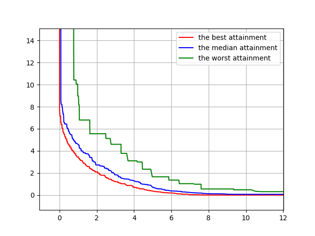
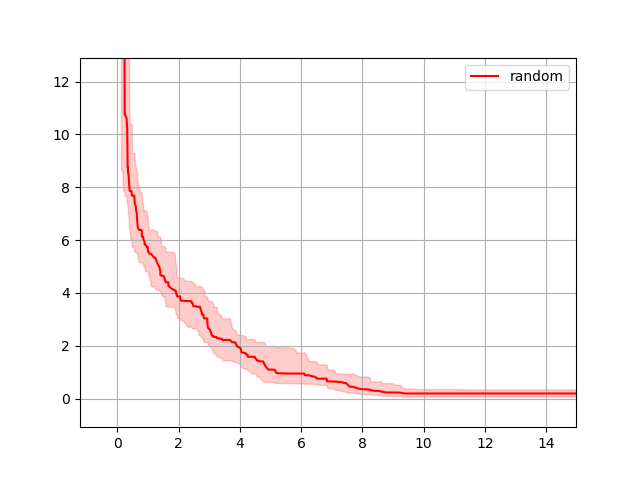

# Empirical attainment function for the bi-objective optimization visualization

[](https://github.com/nabenabe0928/empirical-attainment-func)
[](https://codecov.io/gh/nabenabe0928/empirical-attainment-func)

## Motivation

When we run single-objective optimization problems, comparisons between multiple methods over multiple seeds are not so hard.
Although we could make scatter plots for multi-objective optimization tasks, such plots do not allow comparisons using multiple seeds.
In this repository, we would like to give the solution to this issue.

We use the $k$% attainment surface or empirical attainment function and visualize it as in the figure below.



The original paper is available below.

[1] [On the Performance Assessment and Comparison of Stochastic Multi-objective Optimizers](https://eden.dei.uc.pt/~cmfonsec/fonseca-ppsn1996-reprint.pdf)

**NOTE**

When we define $N$ as `n_independent_runs`, and $K$ as `the number of unique objective values in the first objective`,
the original algorithm requires $O(NK + K \log K)$ and our algorithm requires $O(NK \log K)$ for enumerating the empirical attainment surfaces for each level given a set of Pareto solutions.
Although our time complexity is slightly worse, the implementation is simpler and the runtime is dominated by the enumeration of Pareto solutions in each independent run for both algorithms, so this will not be a big problem.

## Setup & test

1. Install the package

```shell
$ pip install empirical-attainment-func
```

2. Save the following file (`run_test.py`)

```python
import matplotlib.pyplot as plt

import numpy as np

from eaf import get_empirical_attainment_surface, EmpiricalAttainmentFuncPlot


def func(X: np.ndarray) -> np.ndarray:
    f1 = np.sum(X**2, axis=-1)
    f2 = np.sum((X - 2) ** 2, axis=-1)
    return np.stack([f1, f2], axis=-1)


if __name__ == "__main__":
    dim, n_samples, n_independent_runs = 2, 100, 50
    X = np.random.random((n_independent_runs, n_samples, dim)) * 10 - 5
    costs = func(X)

    labels = [f"the {feat} attainment" for feat in ["best", "median", "worst"]]
    levels = [1, n_independent_runs // 2, n_independent_runs]
    colors = ["red", "blue", "green"]
    surfs = get_empirical_attainment_surface(costs=costs, levels=levels)

    _, ax = plt.subplots()
    eaf_plot = EmpiricalAttainmentFuncPlot()
    eaf_plot.plot_multiple_surface(ax, colors=colors, labels=labels, surfs=surfs)
    ax.grid()
    plt.show()

```

3. Run the Python file

```shell
$ python run_test.py
```

## Usage

All you need is to feed `costs` to `get_empirical_attainment_surface`.
The arguments for this function are as follows:
1. `costs` (np.ndarray): The costs obtained in the observations and the shape must be `(n_independent_runs, n_samples, n_obj)`.
2. `levels` (List[int]): A list of levels: level controls the $k$ in the $k$% attainment surface and `k = level / n_independent_runs`. (For more details, see the $k$% attainment surface Section below)
3. `larger_is_better_objectives` (Optional[List[int]]): The indices of the objectives that are better when the values are larger. If None, we consider all objectives are better when they are smaller.

Note that we currently support only `n_obj=2`.

To plot with an uncertainty band, users can do, for example, a median plot with a band between 25% -- 75% percentile.

```python
import matplotlib.pyplot as plt

import numpy as np

from eaf import get_empirical_attainment_surface, EmpiricalAttainmentFuncPlot


def func(X: np.ndarray) -> np.ndarray:
    f1 = np.sum(X**2, axis=-1)
    f2 = np.sum((X - 2) ** 2, axis=-1)
    return np.stack([f1, f2], axis=-1)


if __name__ == "__main__":
    dim, n_samples, n_independent_runs = 2, 100, 50
    X = np.random.random((n_independent_runs, n_samples, dim)) * 10 - 5
    costs = func(X)

    levels = [n_independent_runs // 4, n_independent_runs // 2, 3 * n_independent_runs // 4]
    surfs = get_empirical_attainment_surface(costs=costs, levels=levels)

    _, ax = plt.subplots()
    eaf_plot = EmpiricalAttainmentFuncPlot()
    eaf_plot.plot_surface_with_band(ax, color="red", label="random", surfs=surfs)
    ax.legend()
    ax.grid()
    plt.show()

```

**Output**




# Citation

Please cite the following paper:

```
@article{watanabe2023pareto,
  title   = {{P}ython Tool for Visualizing Variability of {P}areto Fronts over Multiple Runs},
  author  = {S. Watanabe},
  journal = {arXiv:2305.08852},
  year    = {2023},
}
```

This paper has more information as well and we also provide a markdown file [here](supp.md).
